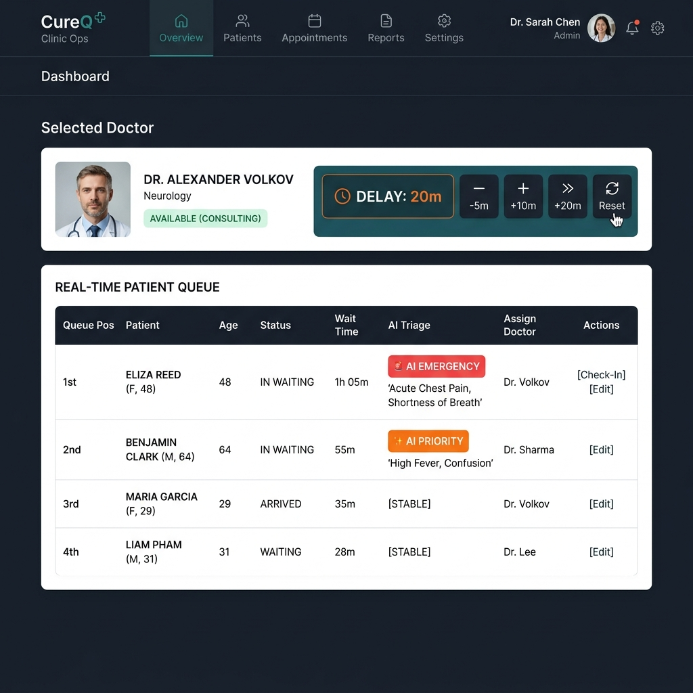

# CureQ - Smart Clinic Queue Management System

[](https://nextjs.org/)
[](https://tailwindcss.com/)
[](https://www.prisma.io/)
[](https://socket.io/)
[](https://www.postgresql.org/)

**CureQ** is an AI-powered SaaS clinic operations platform designed to eliminate crowded waiting rooms and optimize doctor throughput. It replaces traditional paper tokens with a modern, real-time ecosystem featuring virtual check-ins, smart TV display layouts, clinical voice dictation, and business intelligence analytics.

---

## 📸 Core Modules

<div align="center">
  
  <p><em>CureQ Command Center - Real-time Queue Tracking, AI Triage & Delay Buffers</em></p>
</div>

---

## ✨ Features

### 🗂️ 1. Multi-Step Onboarding Wizard
- Quick 3-step setup for new clinics.
- Configure administrator profile, select clinic specialties, and onboard multiple doctor profiles with working hours, consulting days, and time slot configurations.

### 🛎️ 2. Receptionist Command Center
- **Interactive Doctor Dropdown:** Custom header selector showing doctor name initials, active queue count, and live break status (orange coffee badge).
- **Physical Seats Seating Manager:** Treats physical waiting room chairs as a finite resource. Allocates tokens to "Seated" or "Waiting Outside" status dynamically.
- **Seat Capacity Limits:** Increase or decrease seats with a single click.
- **Auto-Promotion Engine:** When seats vacate (e.g. when patients are served, skipped, or enter consultation), the system automatically promotes "Waiting Outside" patients to "Seated" and alerts them via SMS/WhatsApp logs.
- **Quick Walk-In Registration:** Automated phone lookups to register walk-ins or create new patient profiles on the fly.
- **Nudge Priority Re-ordering:** receptionists can manually move tokens up or down the list to prioritize emergency cases.
- **Patient Records Drawer:** Click "View History" on any patient record to slide open a drawer containing all completed visit logs, notes, and doctor ratings.

### 👨‍⚕️ 3. Doctor Console
- **One-Click Calling:** Move the active queue forward (`Call Next`) with one tap, auto-saving the previous consultation.
- **Clinical Voice Dictation:** Integrated speech-to-text allowing doctors to speak prescriptions and clinical notes directly into the patient card.
- **Status Controls:** Doctors can trigger a rest break, broadcasting an "On Break" status and estimated return time to the reception desk and TV displays.

### 🤖 4. CureQ AI Analytics Copilot
- **Data Visualization:** Charts tracking 7-day patient volume (Recharts bar chart), average wait time trends (Recharts area chart), and doctor efficiency reports (consultation time vs. no-show rate).
- **Peak Hours Heatmap:** Hour-by-dayOfWeek grid showing traffic density over the past 30 days.
- **AI Analytics Copilot (Light Themed):** Natural Language Processing panel powered by Gemini/OpenAI. Ask questions like *"Why is the wait time high on Tuesdays?"* or *"Who is my fastest doctor?"* to get data-driven suggestions for clinic schedule optimization.
- **Reports:** One-click CSV downloads of all-time visit logs and direct PDF printing of daily operational reports.

### 📺 5. Smart TV Waiting Room Display
- Fullscreen monitor layout displaying "Now Serving" token numbers and "Up Next" waiting slots.
- **Text-to-Speech (TTS) Voice Calls:** Automatically calls out token numbers aloud (`"Token GP-003, please proceed to Dr. Sharma's chamber"`) in real time using browser audio synthesis.

### 📱 6. Redesigned Patient Portal
- Clean, light-themed health record hub for patients.
- Secure lookup via registered mobile number.
- **Upcoming Appointments:** Displays doctor, specialty, date, and timeslots.
- **Medical History & Rx:** Shows checking date, doctor details, token numbers, and clinical notes in a clean italicized prescription format.
- **Prescription PDF Slips:** Patients can print or download digital prescriptions with a dynamic QR code containing the live tracking link of their current queue status.

---

## 🛠️ Tech Stack

### Frontend
- **Framework:** Next.js 16 (App Router)
- **UI & Styling:** React 19, Tailwind CSS v4
- **State Management:** Zustand
- **Real-time Sync:** Socket.io-client
- **Authentication:** Clerk
- **Charts:** Recharts
- **Icons:** Lucide React

### Backend
- **Runtime:** Node.js (TypeScript)
- **Framework:** Express
- **Database & ORM:** PostgreSQL (Neon Serverless) via Prisma ORM
- **Cache Services:** Memory-Cache
- **Real-time Server:** Socket.io
- **Security:** JWT, bcryptjs

---

## 📂 Project Structure

```text
Clinically/
├── backend/                # Node.js + Express + Prisma (Neon Postgres)
│   ├── prisma/             # Database schema and migration logs
│   ├── src/
│   │   ├── middleware/     # Auth and JWT middlewares
│   │   ├── routes/         # REST API endpoints (Auth, Clinics, Queues, Analytics)
│   │   ├── services/       # Core business logic (AI predictors, cache)
│   │   ├── sockets/        # Real-time WebSocket event emitters
│   │   └── server.ts       # Express server entry point
│   └── tsconfig.json
│
├── frontend/               # Next.js + Tailwind CSS + Zustand
│   ├── app/                # Next.js App Router (Redirection, Onboarding, Analytics, Portal)
│   ├── src/
│   │   ├── components/     # Reusable components (Voice Dictation, Toasts)
│   │   ├── store/          # Zustand queue synchronization store
│   │   └── utils/          # API fetch wrappers and socket links
│   └── next.config.ts
```

---

## 🚀 Getting Started

### Prerequisites
- Node.js (v18+)
- PostgreSQL Database Instance (e.g., Neon Postgres)

### 1. Setup Backend
1. Navigate to backend:
   ```bash
   cd backend
   npm install
   ```
2. Create a `.env` file inside `backend/` and configure variables:
   ```env
   PORT=5000
   DATABASE_URL="postgresql://<username>:<password>@<host>/<database>?sslmode=require"
   JWT_SECRET="your_jwt_secret"
   OPENAI_API_KEY="your_openai_api_key_for_copilot"
   NODE_ENV="development"
   ```
3. Run database migrations:
   ```bash
   npx prisma migrate dev --name init
   ```
4. Start backend in development mode:
   ```bash
   npm run dev
   ```

### 2. Setup Frontend
1. Navigate to frontend:
   ```bash
   cd ../frontend
   npm install
   ```
2. Create a `.env` file inside `frontend/` and configure Clerk key variables:
   ```env
   NEXT_PUBLIC_CLERK_PUBLISHABLE_KEY="your_clerk_publishable_key"
   CLERK_SECRET_KEY="your_clerk_secret_key"
   NEXT_PUBLIC_BACKEND_URL="http://localhost:5000"
   ```
3. Start frontend in development mode:
   ```bash
   npm run dev
   ```

Visit `http://localhost:3000` to access the application.

---

## 💼 Subscription Plans
- **Free:** 1 Onboarded Doctor, 1 Branch, 50 queue tokens/day.
- **Starter:** 3 Doctors, SMS Alerts, Shareable Patient Booking Page, 200 tokens/day.
- **Pro:** Unlimited Doctors, WhatsApp Alerts, AI Copilot, Smart TV Display Mode.
- **Chain:** Multi-branch support, Consolidated chain-wide analytics reports.

---

<p align="center">CureQ — Streamlining clinic workflows with AI-driven operations.</p>
